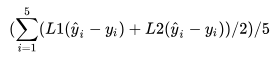
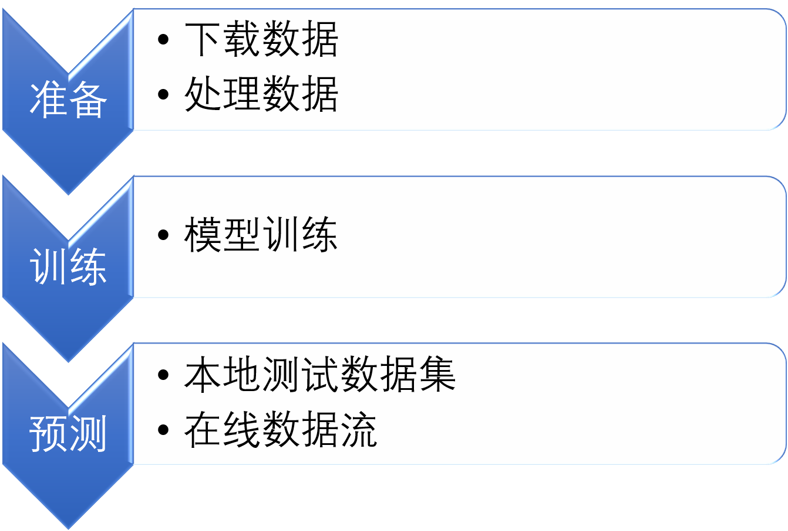
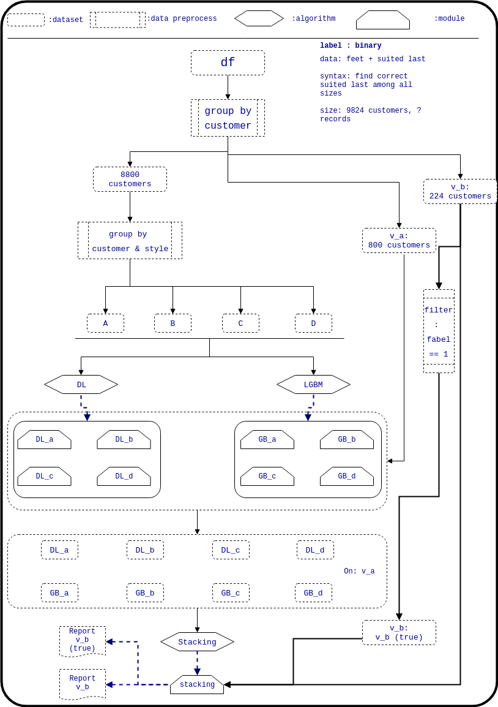

# 基础预测使用说明

本工程包含两种预测任务，分别为分类和回归。分类任务包括对鞋码（size）的分类和舒适度（suit）的分类，回归任务计算脚对鞋子舒适的程度（regress）。训练的脚本分别放在以 train 开头的文件夹内。预测的脚本放在以 predict 开头的文件夹内。验证的脚本分别放在以 validate 开头的文件夹内。

分类任务按照以下规则划分数据：在全部可用的训练数据中，随机选择两种鞋楦或者鞋款，凡是属于这两种鞋楦的试穿数据一律作为测试数据。再随机选择10%的用户，凡是属于这范围内用户的试穿数据一律作为测试数据。其余数据作为训练数据。

回归任务选取一部分用户用于测试，其余用于训练，回归目标为： footshoelastcalculatelength, footbasicwidth, footmetatarsalgirth, foottarsalgirth, footaround 这5个属性。评价指标为，其中L1和L2为1范数和2范数。预测时，输入与size模型的输入相同，但只输入用户与鞋款230码的数据，输出为5个属性的顺序预测值，再将这5个值与鞋款所有码段的对应5个值计算评价指标。评价指标值最小的那个码就是用户的推荐码，评价指标值就是用户对这双鞋的对应部位的舒适度，0表示最舒适，越大越不舒适。

另外本工程包含数据下载和制备训练数据的脚本，为 save_data.py。

## 本工程的执行顺序为：
* 运行 save_data.py 中相应的函数下载和制备可用数据。
* 运行 train 开头文件夹内的脚本进行训练。
* 运行 validate 开头文件夹内脚本可检查模型的正确性，以及在测试数据上的性能。
* 运行 predict 开头文件夹内的脚本可用于预测新的外部数据。

## 执行流程图：  

## 依赖环境：
1. python 3.6或以上, tensorflow 1.8， lightgbm， scikit-learn。
2. xgboost, autosklearn，可根据需要安装。
3. spark 2.3, hadoop 3.1，可根据需要安装。

## save_data.py
    该脚本用于准备数据。若尚未下载数据，则直接在命令行运行该脚本，会自动完成数据的下载和数据的基本处理等操作。
    若数据已经下载，需要重新执行数据的基本处理操作，则可分别执行脚本中的 make_data_size 和 make_data_suit 函数。
    若下载的数据量过大，比如超过内存的一半以上，可选择 spark 结尾的函数进行处理，得到的结果相同，数据存储在 hadoop。

* download_data_old()

    使用分批的方式下载这些数据库：last_decrypt_new，fitting_v1，user_b5_join。下载完毕后自动合并文件，生成完整的3个数据库pkl文件，并删除分批的原文件。数据保存在该脚本的上一级目录的名为 data 的文件夹内。

* download_data_new() 

    一次性下载这些数据库：last_decrypt_new，fitting_v1_lp1，fitting_v1_fp1_lp1_fit。数据保存在该脚本的上一级目录的名为 data 的文件夹内。

* make_data_size() 

    若数据下载完成，则运行本函数处理数据，处理完毕的数据保存在该脚本的上一级目录的名为 data 的文件夹内。

* make_data_suit()

    若数据下载完成，则运行本函数处理数据，处理完毕的数据保存在该脚本的上一级目录的名为 data 的文件夹内。

* download_data_spark() 

    与 download_data_new 功能相同，采用 spark 下载数据，数据保存在 hadoop 根目录 data 文件夹内。

* make_data_size_spark() 

    与 make_data_size 功能相同，采用 spark 处理数据，数据保存在 hadoop 根目录 data 文件夹内。

* make_data_suit_spark()

    与 make_data_suit 功能相同，采用 spark 处理数据，数据保存在 hadoop 根目录 data 文件夹内。   

## preprocess_data.py
    该脚本用于准备模型需要的数据，不需要单独运行。

## mlp.py 或 mlp_eager.py
    该脚本测试多层感知机的预测效果。带 eager 结尾表示使用 tensorflow 的eager 模式。

## lgbm.py
    该脚本测试LightGBM模型的效果。该脚本自动调参。

## stack_mlp.py 或 stack_lgbm.py
    该脚本测试 stack 方法的性能，融合了 mlp 模型 和 gbm 模型。

## size预测数据流图
